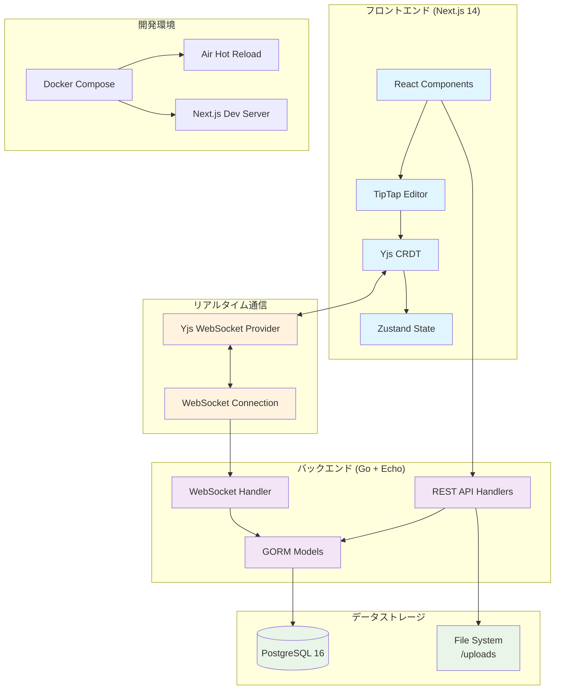
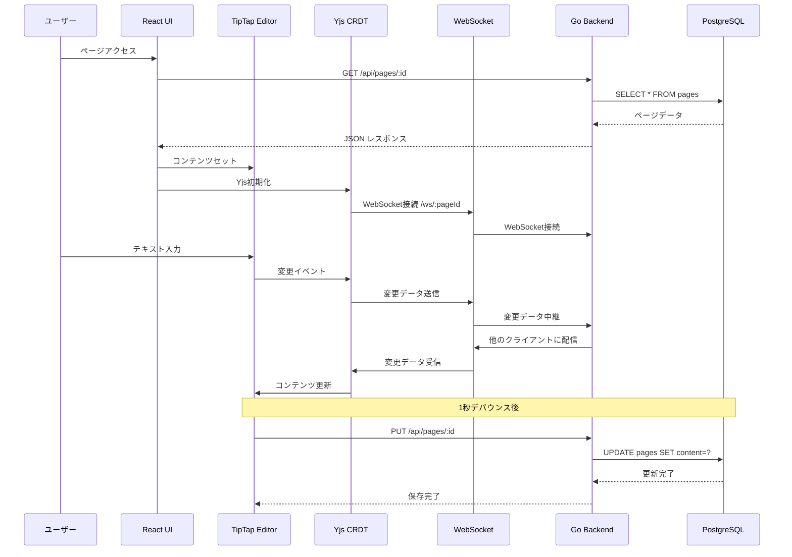
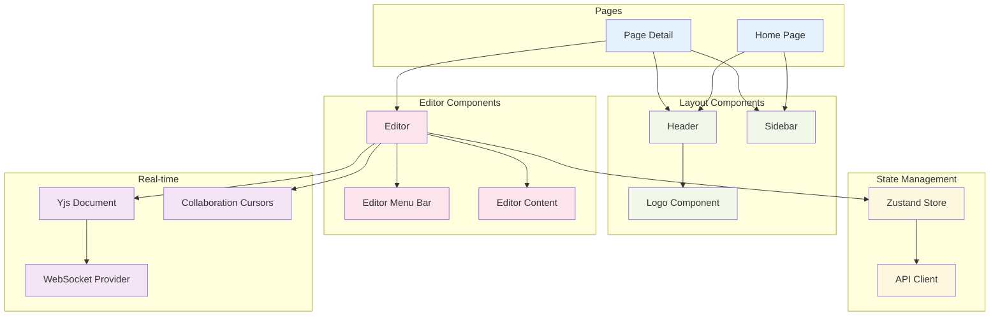

# システムアーキテクチャ

リアルタイムメモアプリの全体アーキテクチャとデータフローを説明します。

## 全体アーキテクチャ図

## データフロー図

## コンポーネント構成

## 技術スタック詳細

### フロントエンド
- **Next.js 14**: App Router、TypeScript、Tailwind CSS
- **TipTap v2**: リッチテキストエディター
- **Yjs**: CRDT（Conflict-free Replicated Data Type）
- **Zustand**: 軽量状態管理
- **Radix UI**: アイコンライブラリ

### バックエンド
- **Go 1.23**: 高性能バックエンド言語
- **Echo v4**: 軽量Webフレームワーク
- **GORM v2**: Go用ORM
- **Gorilla WebSocket**: WebSocket実装
- **Air**: ホットリロード開発ツール

### データベース
- **PostgreSQL 16**: メインデータベース
- **JSONB**: リッチコンテンツ保存用
- **File System**: ファイルアップロード保存先

### 開発・デプロイ
- **Docker Compose**: 開発環境構築
- **Git**: バージョン管理
- **GitHub Actions**: CI/CD（予定）

## セキュリティ考慮事項

1. **入力検証**: フロントエンド・バックエンド両方で実装
2. **CORS設定**: 適切なオリジン制限
3. **SQL インジェクション対策**: GORM の Safe Query 使用
4. **XSS対策**: TipTapのHTMLサニタイゼーション
5. **ファイルアップロード制限**: ファイルタイプ・サイズ制限

## パフォーマンス最適化

1. **リアルタイム同期**: Yjs CRDTによる効率的な差分同期
2. **自動保存**: デバウンス機能でAPIコール最適化
3. **JSONB活用**: PostgreSQLの高速JSON操作
4. **コンポーネント最適化**: React.memo、useMemo活用
5. **バンドル最適化**: Next.js の自動最適化機能

## 拡張性

このアーキテクチャは以下の拡張に対応できます：

1. **マルチテナント**: ユーザー・組織管理
2. **権限システム**: ページ単位のアクセス制御
3. **プラグインシステム**: TipTap拡張機能
4. **API拡張**: RESTful API の機能追加
5. **スケーリング**: マイクロサービス分割対応