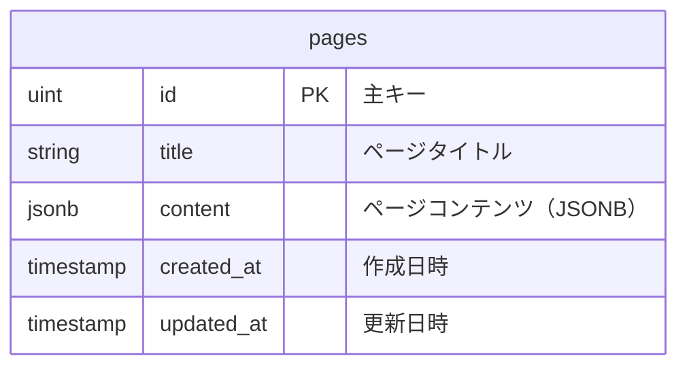

# データベーススキーマ

リアルタイムメモアプリのデータベース設計図です。

## ER図



## テーブル詳細

### pages テーブル

| カラム名 | データ型 | 制約 | 説明 |
|---------|---------|------|------|
| id | uint | PRIMARY KEY, AUTO_INCREMENT | ページの一意識別子 |
| title | string | NOT NULL | ページのタイトル |
| content | jsonb | - | TipTapエディターのコンテンツ（JSON形式） |
| created_at | timestamp | NOT NULL | ページ作成日時 |
| updated_at | timestamp | NOT NULL | ページ最終更新日時 |

### コンテンツ構造（JSONB）

`content`フィールドには、TipTapエディターのドキュメント構造がJSON形式で保存されます：

```json
{
  "doc": {
    "type": "doc",
    "content": [
      {
        "type": "paragraph",
        "content": [
          {
            "type": "text",
            "text": "サンプルテキスト"
          }
        ]
      },
      {
        "type": "heading",
        "attrs": {
          "level": 1
        },
        "content": [
          {
            "type": "text", 
            "text": "見出し"
          }
        ]
      },
      {
        "type": "bulletList",
        "content": [
          {
            "type": "listItem",
            "content": [
              {
                "type": "paragraph",
                "content": [
                  {
                    "type": "text",
                    "text": "リスト項目"
                  }
                ]
              }
            ]
          }
        ]
      },
      {
        "type": "codeBlock",
        "attrs": {
          "language": "javascript"
        },
        "content": [
          {
            "type": "text",
            "text": "console.log('Hello World');"
          }
        ]
      }
    ]
  }
}
```

## インデックス

- `id` - 主キー（自動作成）
- `created_at` - 作成日時での並び替え用
- `updated_at` - 更新日時での並び替え用

## 特徴

1. **JSONB使用**: PostgreSQLのJSONB型を使用してリッチなコンテンツ構造を効率的に保存
2. **リアルタイム対応**: Yjsによるリアルタイム編集に最適化された設計
3. **柔軟性**: TipTapの多様なノードタイプに対応できる柔軟なJSONB構造
4. **パフォーマンス**: JSONBの効率的なクエリ機能を活用

## リアルタイム同期

- **Yjs**: クライアント間でのリアルタイム同期にYjs（CRDT）を使用
- **WebSocket**: `/ws/:pageId`エンドポイントでリアルタイム通信
- **自動保存**: 1秒のデバウンスで自動保存機能

## 今後の拡張可能性

現在の設計では以下の拡張が容易に実装可能です：

1. **ユーザー管理**: `users`テーブルの追加
2. **ページ権限**: ページごとのアクセス制御
3. **バージョン履歴**: ページの変更履歴追跡
4. **ファイル管理**: アップロードファイルの構造化管理
5. **タグ・カテゴリ**: ページ分類システム